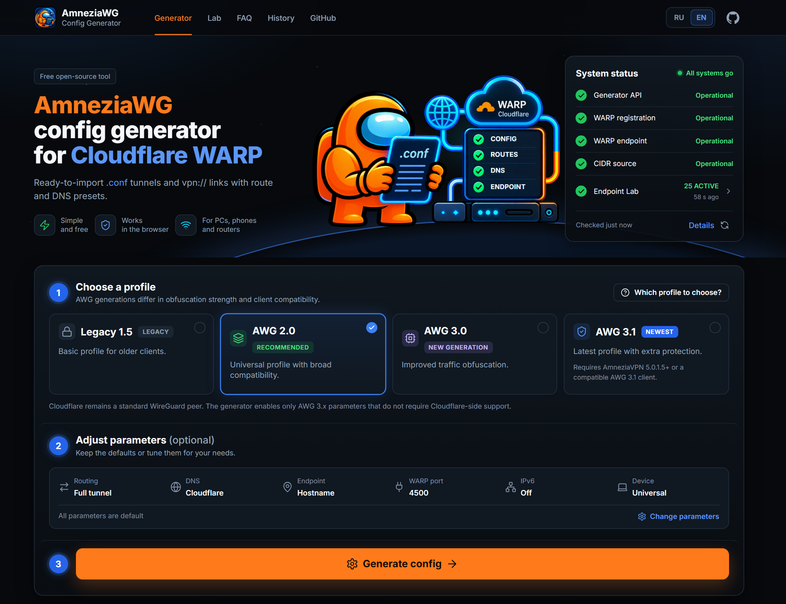

# 🌐🔧 AmneziaWG Config Generator

[English](./README.md) | [Русский](./README.ru.md)

Web UI and HTTP API for building `.conf` files for the **AmneziaWG** client (WireGuard with Amnezia obfuscation extensions). Primary use case: **Cloudflare WARP** profiles — registers a fresh WARP device via Cloudflare's official API, returns the keys and tunnel parameters, optionally narrows `AllowedIPs` to selected domain presets. Since 3.0 the endpoint can also come from **Endpoint Lab** — the project's own check of WARP endpoints.

| | |
| --- | --- |
| **Generator** | <https://awgconfig.com/> |
| **Telegram channel** | <https://t.me/amnezia_config> |
| **Source code** | <https://github.com/HereIamGosu/amnezia-config-gen> |

[](LICENSE)
[](https://nodejs.org/)
[](https://github.com/HereIamGosu/amnezia-config-gen/actions/workflows/ci.yml)
[](https://github.com/HereIamGosu/amnezia-config-gen/releases/latest)
[](https://github.com/HereIamGosu/amnezia-config-gen/commits/main)
[](https://github.com/HereIamGosu/amnezia-config-gen/issues)



## Features

- Explicit routing mode selection: full tunnel (all traffic) or split tunnel (selected presets only)
- Four config formats: **Legacy**, **AWG 2.0**, **AWG 3.0**, and **AWG 3.1** (`mode=legacy|awg2|awg3|awg31`). AWG 3.x modes use a WARP-safe client-side profile.
- Up to three configs per request (`count=1..3`), each with its own WARP registration and keys.
- **Endpoint Lab** (`/lab`, `/en/lab`, `GET /api/lab`): a read-only view of Cloudflare WARP endpoints (`IP:UDP port`) that the project server checks with a real WireGuard handshake and HTTPS traffic through the tunnel. An endpoint that passes is ACTIVE for 7 minutes and has to pass again to stay. The checks run from the project server, so they show that an endpoint works from there, not from every network.
- **Lab Auto** (`endpointMode=lab`): every config gets its own fresh ACTIVE endpoint from the Lab, with distinct IPs. Without fresh Lab data no config is created (`503 lab_*`), never a silent fallback. In the web interface it is the default endpoint while the Lab pool is fresh; otherwise the interface selects the hostname `engage.cloudflareclient.com` and says why, and a Lab refusal offers an explicit "Generate with the hostname" button. The API default stays the hostname.
- Dark interface in Russian (`/`) and English (`/en`); the language follows the address. The "System status" card shows the generator API, WARP registration, the WARP endpoint, the CIDR source and the Endpoint Lab.
- Route presets: tile-selectable domain bundles → aggregated IPv4 (or IPv4+IPv6) CIDRs in `AllowedIPs`. With no selection, defaults to `0.0.0.0/0`; `::/0` is added only when IPv6 is explicitly enabled.
- DNS presets for the `DNS` line in the config.
- One-click `.conf` download for import into AmneziaWG and compatible clients.
- After generation, an explainable result card summarizes the AWG format, variants, endpoint and route sources, profiles, IPv6, `vpn://` availability, risk labels, and practical first diagnostic steps.
- `cps5`, `mobile`, `link` opt-in extras (see [Optional Extras](#optional-extras)).
- Cloudflare WARP API requests retry on network errors and 429 / 502 / 503 / 504 responses.

## Telegram channel

The **[Amnezia Config](https://t.me/amnezia_config)** Telegram channel publishes breakdowns of generator updates, diagnostics for endpoint, DNS, UDP, AllowedIPs, mobile profile, and config import issues.

The channel does not promise universal connectivity in any network. The materials explain how the settings work and where to look if the tunnel behaves differently across devices or networks.

## Requirements

- **Node.js 22** (`engines` in `package.json`).
- **Vercel CLI** only for `npm start` (`vercel dev`): `npm i -g vercel` or `npx vercel dev`.

No `.env` is required — the app calls Cloudflare's public WARP API directly.

## Local development

```bash
npm install
npm start          # vercel dev → http://localhost:3000
# or the same runtime as production, without Vercel:
node server.js     # http://localhost:3000 (PORT, HOST)
```

If you open the static files in `public/` without a server, the UI loads presets from `public/static/presets-fallback.json` but `/api/iplist` and `/api/warp` won't work.

Endpoint Lab data is not part of the repository. Locally, `/lab` reports that the Lab data is unavailable, `/api/lab` answers `503 lab_not_available` and Lab Auto answers `503 lab_unavailable`; the hostname mode works. To see the Lab locally, point `ENDPOINT_LAB_PUBLIC_DIR` (absolute path, read at start-up) to a copy of the Lab public directory.

## Deploy

The official site <https://awgconfig.com/> is self-hosted: every push to `main` that passes CI is built
once, tested, and published to GHCR by digest; the server pulls the verified image and switches
traffic blue/green with an automatic rollback. Details: [`deploy/CI_CD.md`](deploy/CI_CD.md),
[`deploy/CONTROLLER.md`](deploy/CONTROLLER.md).

Endpoint Lab runs on the same server as a separate host service (`deploy/endpoint-lab/`); the web
container only gets the Lab's secret-free public directory, mounted read-only. Details:
[`deploy/ENDPOINT_LAB.md`](deploy/ENDPOINT_LAB.md).

Forks keep working on **Vercel** as before: connect the repository in the Vercel dashboard or run
`vercel` / `vercel --prod` from the project root. A fork has no Endpoint Lab: the generator works in
the hostname mode, `/lab` reports that the Lab data is unavailable.

## Privacy-safe telemetry

Product events use the existing Yandex.Metrika integration through the no-op-safe adapter in `public/static/analytics.js`. If analytics is unavailable or blocked, product actions continue normally.

Tracked events: `generation_started`, `generation_succeeded`, `generation_partially_succeeded`, `generation_failed`, `config_downloaded`, `config_preview_opened`, `vpn_link_copied`, `history_item_previewed`, `history_item_downloaded`, `healthcheck_opened`, and `status_modal_opened`.

Only bounded product metadata is allowed: mode, requested/produced counts, endpoint/route source categories, warning counts, full/split route mode, mobile/router flags, CPS mode, AWG WARP-safe/timing/experimental-padding booleans, non-negative generation duration, and a coarse error category. The adapter does **not** collect `.conf` contents, `PrivateKey`, `PresharedKey`, WARP tokens, full endpoint strings, `AllowedIPs`, custom CIDRs, raw error messages, or a full user agent supplied by the application.

## Repository layout

| Path | Purpose |
|---|---|
| `public/index.html` | UI entry point (Russian, `/`) |
| `public/en/index.html`, `public/en/lab/index.html` | English pages (`/en`, `/en/lab`), generated by `npm run seo:en` — do not edit |
| `public/lab/` | Endpoint Lab page (`/lab`): markup, styles and scripts |
| `public/404.html`, `robots.txt`, `sitemap.xml`, `llms.txt`, `.well-known/security.txt` | Error page and files for search engines, AI search and security reports |
| `public/static/*.js`, `styles.css` | Frontend: `script.js` (generation and wiring) plus `i18n.js`, `common.js`, `status.js`, `live-status.js`, `result.js`, `result-explanation.js`, `settings.js`, `settings-link.js`, `history.js`, `share-link.js`, `ui-shell.js`, `analytics.js`, `metrika.js`, `status-page.js`; styles |
| `public/locales/{ru,en}.json` | Interface strings for both languages |
| `public/static/presets-fallback.json` | Offline fallback preset catalogue |
| `api/warp.js` | WARP config generation endpoint (hostname mode and Lab Auto) |
| `api/iplist.js` | Preset list and CIDR preview |
| `api/status.js`, `api/healthcheck.js` | Data for the "System status" card |
| `api/lab.js` | Read-only Endpoint Lab data for `/lab` |
| `src/server/awg/` | AWG profiles, strict ranges, WARP safety, and final serialization |
| `src/server/routePresets.js` | Source of truth for all route and DNS presets |
| `src/server/ipListFetch.js` | Domain → CIDR resolution (10-min in-memory cache) |
| `src/server/warpCpsPayloads.js`, `src/server/cps/` | Pool of verified WARP-compatible CPS payloads and CPS packet generators |
| `src/server/cps-presets/` | Text files referenced via `i1Ref` query param |
| `src/server/cpsExtraPackets.js` | Generates I2..I5 for `cps5=1` |
| `src/server/vpnLinkBuilder.js` | Builds `vpn://...` AmneziaVPN one-tap import URI |
| `src/server/labPublic.js`, `src/server/endpointProvider.js` | Reading and validating the Lab public files; endpoint selection for Lab Auto |
| `src/server/_rateLimit.js` | Per-IP rate limiter (10 generations/min) |
| `server.js` | Self-hosted runtime used in production: routes and headers from `vercel.json` |
| `deploy/` | Docker image, nginx, blue/green deploy controller, Endpoint Lab host service (`deploy/endpoint-lab/`) |
| `scripts/dump-presets-fallback.js` | Regenerates `presets-fallback.json` from `routePresets.js` |
| `__tests__/` | `node:test` suite, including the critical-invariant tests `invariant-*.test.js` |
| `e2e/` | Browser tests in a local Chrome (`npm run test:e2e`) |

## Critical invariants

These rules are non-obvious, easy to break, and silently fatal. They are enforced by `__tests__/invariant-*.test.js`. **If you change any of them, update both the test and this block.**

| ID | Rule | Why |
|---|---|---|
| **I1** | The `[Interface]` line MUST be uppercase `I1`, not `i1`. | Lowercase `i1` is silently ignored by the AmneziaWG Windows client. Reference: [wg-easy/wg-easy#2439](https://github.com/wg-easy/wg-easy/issues/2439). |
| **I2** | For every WARP-safe AWG 2/3.x profile: `S1 = S2 = S3 = S4 = 0`. | Cloudflare's peer is stock WireGuard and does not add AWG byte prefixes. |
| **I3** | For every WARP-safe AWG 2/3.x profile: `H1..H4 = 1, 2, 3, 4`. | Cloudflare expects the standard WireGuard message types. |
| **I4** | WARP-safe profiles use `MTU = 1280`; AWG 3.x never emits `HeaderProtectionKey` or enables `RandomTrailers`; AWG 3.1 may enable the local-only `DisableCookies`. | Peer-dependent wire-format changes cannot interoperate with the stock Cloudflare peer; local cookie behaviour does not require Cloudflare support. |
| **I5** | AmneziaWG 2.0 `[Interface]` field order: `PrivateKey → Address → DNS → MTU → Jc → Jmin → Jmax → S1..S4 → H1..H4 → I1`. | Matches the order `amneziawg-go` UAPI accepts. |
| **I6** | `AllowedIPs` defaults to **IPv4-only**; IPv6 is opt-in via the Settings IPv6 toggle (`?ipv6=1`). | Routers (GL.iNet, Keenetic, MikroTik) and mobile clients have limited routing-table capacity; doubling the route count via IPv6 causes silent failures. |
| **I7** | `mobile=1` overrides: `Jc=3, Jmin=64, Jmax=128, MTU=1280`, IPv4-only enforced (overrides `ipv6=1`, strips IPv6 from `Address` and `AllowedIPs`). | Mobile-tuned profile within AWG 2.0 spec; reduces battery drain and silent resets on iOS. |
| **I8** | When both `mobile=1` and `router=1` are set, `mobile` is applied first, then `router` caps via `Math.min`/`Math.max`. Router caps win on overlap (e.g. final `Jc = 2`). | Composition rule applied in `applyRouterModeCaps` after `applyMobileModeOverrides`. |
| **I9** | `cps5=1` adds `I2`–`I5` for AWG 2.0/3.x when `I1` is non-empty. | Legacy mode and AWG modes without `I1` must not emit partial CPS chains. |
| **I10** | `vpn://` must survive the Qt `qCompress` round-trip and identify the payload as a ready third-party AWG profile. | Prevents AmneziaVPN from treating the import as a protocol-installation flow. |
| **I11** | Lab Auto (`endpointMode=lab`) changes only `Endpoint`: for the same request every other field, its order and the response metadata match hostname mode (keys, junk sizes and CPS packets are random in both). Without usable Lab data it answers `503 lab_*` before any WARP registration and never falls back to hostname. | Lab endpoints are chosen per request from a pool verified minutes ago; a silent hostname fallback would hide that the requested verification did not happen. |

## API

### `GET` / `POST` `/api/warp`

Returns JSON: `success`, on success `content` (`.conf` body in **base64**; with `count` > 1 the first config), `configs` (every config with its own `content`, `endpointSource`, CPS fields and `vpnLink`), `count`, `mode` (`legacy` | `awg2` | `awg3` | `awg31`), optionally `routesSource`, privacy-safe `routesTelemetrySource`, `routesPresets`, `presetSitesCount`, `appliedExtras`, `vpnLink`, `compatibility`, and AWG 3.x-only `awg` capability metadata.

Parameters via query string (`GET`) or JSON body fields (`POST`). Body field names match query param names (handy for long `i1`).

| Param | Description |
|---|---|
| `mode` | `legacy` (default), `awg2`, `awg3`, or `awg31`; accepted AWG 3.x aliases include `3`, `3.0`, `awg30`, `v3`, `3.1`, and `v3.1` |
| `count` | `1`–`3` configs in one response (default `1`); each config is a separate WARP registration |
| `presets` | Comma-separated preset keys (or array in JSON body) |
| `dns` | DNS preset key; UI default is `cloudflare` |
| `template` | See [Templates](#templates) |
| `peerEndpoint`, `endpoint` | Full `host:port` for `Endpoint` (used as-is when given) |
| `warpPort` | UDP port for `engage…` or IP fallback (default for WARP templates: **4500**; classic wgcf often: **2408**) |
| `endpointMode` | `hostname` (default, unchanged behaviour) or `lab` — Lab Auto: each config gets a distinct fresh ACTIVE endpoint of the Endpoint Lab. The requested port is a preference: the Lab verifies 2408/500/1701/4500, a shortfall on that port is filled from other verified ports and reported. Fewer distinct endpoints than `count` → fewer configs plus a warning, never duplicates. Only for WARP templates; not with `peerEndpoint`. |
| `persistentKeepalive`, `keepalive` | Integer for older modes; strict integer or `min-max` range for AWG 3.x (default `25-35`) |
| `rekeyAfterTime`, `rekeyTimeout`, `rejectAfterTime`, `keepaliveTimeout`, `maxHandshakeAttempts` | AWG 3.x strict integer/range overrides; defaults: `100-120`, `3-7`, `150-180`, `5-15`, `15-20` |
| `contentPaddingAddition` | AWG 3.x encrypted payload padding; defaults to `10-100`; `off`, `0`, or `0-0` disables it; accepts a strict `0..65535` integer/range |
| `experimentalContentPadding` | Deprecated compatibility flag; `true` remains accepted, while padding now follows `contentPaddingAddition` directly |
| `disableCookies` | AWG 3.1-only strict `on/off` toggle (also `true/false/1/0`); defaults to `on` |
| `i1` | Raw CPS / obfuscation string (AWG 2.0) |
| `i1Ref` | Filename from `src/server/cps-presets/` |
| `cps` | `auto` (stable `static` / `sip` / `stun` only), or explicit `static`, `sip`, `stun`, `quic`, `dns`, `dtls`; the latter three are experimental. `tls` and unknown IDs return HTTP 400. |
| `plainAddress` | `1` / `true` — omit `/32` and `/128` from `Address` |
| `ipv6` | `1` — also include IPv6 CIDRs from presets |
| `cps5` | `1` — append random `I2`..`I5` to `[Interface]` (for `mode=awg2`, `awg3`, `awg31`; requires non-empty `I1`) |
| `mobile` | `1` — mobile profile (see I7) |
| `router` | `1` — router caps profile |
| `link` | `1` — include `vpnLink: "vpn://..."` in JSON response for AmneziaVPN one-tap import |

Errors: JSON `{ success: false, message }`; HTTP 4xx/5xx as appropriate.

Lab Auto adds `endpointSource: "lab"` per config and `lab: { requested, selected, requestedPort, portMatched, ports }`. Its refusals are `{ success: false, error, message }`: `400 invalid_endpoint_mode`, `400 endpoint_mode_conflict` (with `peerEndpoint`), `400 lab_template_unsupported` (non-WARP template); `503 lab_unavailable` (no or unusable Lab data, or the Lab reports itself unavailable), `503 lab_stale`, `503 lab_no_endpoints` with `Retry-After: 60`. Freshness is decided once, before registration; the request then keeps those endpoints.

### `GET` `/api/iplist`

Without `?presets=...`: returns the full preset catalogue (`presets`, categories, `dnsPresets`, `dnsDefault`, etc.).

With `?presets=key1,key2`: resolves domains to CIDRs. Response: `{ count, count4, count6, cidrs, sites, sitesQueried, cidrSource }`. `cidrSource` reports the actual route source (`opencck`, `community`, `mixed`, `antifilter`, or `static`). Unknown keys → 400 with the offending list.

### `GET` `/api/lab`

Read-only Endpoint Lab data for `/lab`; it never controls the Lab. Without parameters: the overview (`status`, `generatedAt`, `freshness`, events and `endpoints` with the public states `ACTIVE`, `VERIFIED`, `SUSPECT`). With `?endpoint=<ip:port>&range=24h|7d|30d|all` (default `all`): the history of one endpoint.

Errors are `{ success: false, code }`: `400 endpoint_invalid`, `400 range_invalid`, `404 endpoint_not_found`, `405 method_not_allowed`; `503 lab_not_available` when the Lab public files are missing (Vercel, forks, no Lab mount) and `503 lab_malformed` when they fail validation, both with `Retry-After`. Responses are `Cache-Control: no-store` and `X-Robots-Tag: noindex, nofollow`.

### `GET` `/api/status`

Endpoint registry summary for the "System status" card: `status`, `updated_at`, `active_endpoints`, per-port `ports` and `candidates` (counts only, never IPs), `health_source`, `message`, and `lab: { available }`, which tells the page whether Endpoint Lab data is there.

### `GET` `/api/healthcheck`

TCP reachability of `api.cloudflareclient.com:443`, `engage.cloudflareclient.com:443` and `iplist.opencck.org:443`: `{ services: { api, engage, cidr }, checkedAt }`. The result is cached for 30 seconds.

## Templates

| Value | Behaviour |
|---|---|
| *(none)* + `mode=legacy` | Same as `warp_amnezia` |
| *(none)* + `mode=awg2` | Same as `warp_amnezia_awg2` |
| *(none)* + `mode=awg3` / `mode=awg31` | WARP-safe AWG 3.0 / 3.1 client profile |
| `warp_amnezia`, `amnezia`, `amnezia_warp` | Legacy WARP with engage-host endpoint, embedded `I1` if no user-supplied one, `plainAddress`, keepalive 25 |
| `warp_amnezia_awg2`, `amnezia_awg2`, `awg2_amnezia`, `warp_awg2_amnezia` | AWG 2.0 WARP — same peer/DNS/Address/I1 as Legacy WARP, with WARP-safe S=0 / H=1..4 / MTU=1280 |
| `warp_amnezia_awg3`, `warp_awg3_amnezia` | AWG 3.0 WARP-safe profile |
| `warp_amnezia_awg31`, `warp_awg31_amnezia` | AWG 3.1 WARP-safe profile with explicit safe 3.1 flags |
| `wgcf` | `engage.cloudflareclient.com`, UDP 4500, no embedded I1 |
| `awg2_random`, `awg2_dpi` | Random H bands — **NOT** for Cloudflare WARP; bring your own endpoint |

## Optional Extras

### CPS protocol status

| Protocol | Status | Auto | Notes |
|---|---|---:|---|
| Static | stable | yes | Verified project WARP payload pool |
| SIP | stable | yes | Coherent randomized SIP INVITE |
| STUN | stable | yes | Binding Request with valid FINGERPRINT |
| QUIC | experimental | no | Protected QUIC v1 Initial-shaped packet; interop pending |
| DNS | experimental | no | Response-shaped DNS packet; interop pending |
| DTLS | experimental | no | DTLS 1.2 ClientHello-shaped packet; interop pending |
| TLS | unsupported | no | Rejected with HTTP 400 |

| Param | Effect |
|---|---|
| `cps5=1` | When `mode` is `awg2`, `awg3` or `awg31` and `I1` is non-empty, server appends `I2..I5` (random hex 16–64 bytes each via `crypto.randomBytes`) to `[Interface]`. Silently ignored for Legacy or empty `I1`. |
| `mobile=1` | Mobile-tuned profile per invariant **I7**. |
| `router=1` | Router caps profile (`Jc≤2`, `Jmin∈[40,128]`, `Jmax∈[Jmin+1,128]`); composes with `mobile` per invariant **I8**. |
| `link=1` | Response gains `vpnLink: vpn://<base64url(qCompress(JSON))>` for one-tap import in AmneziaVPN mobile app. |

`appliedExtras: { cps5, mobile }` in the response reports what was actually applied (`cps5` may be `false` even when requested — Legacy mode silently ignores it).

Successful responses also report secret-free `cpsRequested`, `cpsResolved`, `cpsStability`, and additive `cpsEvidenceStatus` fields. For `count=1..3`, every `configs[]` entry carries its own resolution; Auto is resolved independently for each config. QUIC is a protected 1200-byte QUIC v1 Initial-shaped packet split into adjacent fixed-byte CPS tags without truncation, but remains experimental until WARP interoperability is confirmed. Static/SIP/STUN are stable with verified project evidence; QUIC/DNS/DTLS are experimental, TLS is unsupported, and Auto selects stable protocols only.

## Compatibility

Since 2.7.0 the `/api/warp` response carries an optional, additive `compatibility` summary
(`recommended` / `experimental` / `notRecommended` / `warnings`). It is metadata only:
it never contains keys, `.conf` text, or the `vpn://` payload, and it does not change any
existing response field. After a generation the UI shows a compatibility card that tells you
which clients are a reasonable target for the produced profile.

The compatibility model lives in [`src/server/clientCompatibility.js`](src/server/clientCompatibility.js)
via `getCompatibilityForGeneration({ mode, exportType, mobile, router, link })`.

### AWG 2.0 and Cloudflare WARP

AWG 2.0 refers to **client-side configuration parameters**. The Cloudflare WARP peer remains a
standard WireGuard peer, so some WARP parameters are intentionally fixed (see the AWG 2.0 / WARP
invariants above). Selecting AWG 2.0 does **not** mean Cloudflare's server supports AWG 2.0.

### AWG 3.0 / 3.1 and Cloudflare WARP

Cloudflare remains a standard WireGuard peer. The generator enables client-side AWG 3.x features: junk/CPS packets, randomized rekey/handshake/keepalive timing, a `PersistentKeepalive` range, and encrypted `ContentPaddingAddition` (`10-100` by default, disableable with `off`, `0`, or `0-0`). AWG 3.1 also defaults `DisableCookies=on`; this suppresses the local under-load Cookie Reply branch, keeps incoming cookie handling intact, and reduces local anti-DoS protection as an anti-fingerprinting trade-off. `H1..H4` stay `1..4`, `S1..S4` stay zero, Header Protection is unavailable, and `RandomTrailers=on` is always rejected: Cloudflare's tolerance of trailers is undocumented and the mechanism depends on peer receive behaviour. See [current protocol evidence](docs/protocol-evidence.md); historical release notes describe their own snapshots.

AWG 3.x requires a modern compatible parser. For AWG 3.1, AmneziaVPN 5.0.1.5+ or a compatible AWG 3.1 client is recommended. Router compatibility depends on the router implementation. AWG 3.0 `vpn://` export is deliberately unavailable because its historical `protocol_version` mapping has not been confirmed; AWG 3.1 uses the confirmed `3.1` envelope.

### Export targets

[`src/server/exportTargets.js`](src/server/exportTargets.js) is a v0 registry describing output
formats and how ready each one is:

| Target | Status |
|---|---|
| `.conf` | stable |
| `vpn://` | stable for existing modes and AWG 3.1; unavailable for AWG 3.0 pending protocol evidence |
| QR | experimental |
| sing-box / Mihomo / Clash | experimental |
| Throne | research |
| OpenWrt | documentation |

Experimental and research targets are **not** stable exporters — they are labelled honestly so
they are not mistaken for a working import path. The generator reduces manual configuration, but
it does not guarantee connectivity in every network or client.

## NPM scripts

| Command | Action |
|---|---|
| `npm start` | `vercel dev` |
| `npm run lint` | ESLint (`--max-warnings 0`) |
| `npm test` | Run all tests via built-in `node:test` |
| `npm run test:e2e` | Browser tests in a local Chrome (`e2e/`) |
| `npm run test:coverage` | Run tests with experimental coverage |
| `npm run presets:fallback` | Regenerate `public/static/presets-fallback.json` from `src/server/routePresets.js` |
| `npm run evidence:check` | Check that the protocol evidence (`docs/protocol-evidence.md`) is current; `evidence:generate` regenerates it |
| `npm run release:check` | Release consistency: `package.json`, CHANGELOG, asset `?v=` keys, version claims in the READMEs |
| `npm run indexnow` | Submit the sitemap URLs to IndexNow (Bing, Yandex and others); `--wait-revision <sha>` waits for the deploy, `--since <commit>` skips unchanged releases, `--dry-run` |
| `npm run seo:en` | Regenerate the English pages `public/en/index.html` and `public/en/lab/index.html` from the Russian pages and `public/locales/en.json` (`seo:check` verifies) |
| `npm run assets:build -- <dir>` | Minify and precompress static assets in `<dir>`; the Docker build runs it on a copy of `public/` |
| `npm run build` | No-op (no build step required) |

To run a single test file: `node --test __tests__/invariant-i1-uppercase.test.js`.

Release 2.4.1 fallback smoke coverage is in `__tests__/fallback-smoke.test.js`: no-KV generation, partial endpoint failure, CIDR source fallback, `/api/status` registry source, and `/api/iplist` route source.

Manual `vpn://` import verification for iOS: [docs/manual-checks/vpn-link-ios.md](docs/manual-checks/vpn-link-ios.md).

## External source usage

This project may study external open-source projects for architecture ideas, compatibility notes, endpoint intelligence patterns, diagnostics, and UI references.

Do not copy external code before checking its license. If a repository has no license, an unclear license, or an incompatible license, reimplement the mechanism independently and use only the idea or behaviour as a reference.

External IP feeds and endpoint sources must never be exposed directly to generated user configs. They must go through the internal candidate pipeline and health checks.

The per-project license review lives in [docs/research/external-source-license-audit.md](docs/research/external-source-license-audit.md) (engineering audit, not legal advice).

## Contributing

See [CONTRIBUTING.md](./CONTRIBUTING.md). For security reports: [SECURITY.md](./SECURITY.md). All contributors are bound by the [Code of Conduct](./CODE_OF_CONDUCT.md).

## License

[AGPL-3.0-only](./LICENSE) — © 2026 HereIamGosu.

## Star History

<a href="https://star-history.com/#HereIamGosu/amnezia-config-gen&Date">
 <picture>
   <source media="(prefers-color-scheme: dark)" srcset="https://api.star-history.com/svg?repos=HereIamGosu/amnezia-config-gen&type=Date&theme=dark" />
   <source media="(prefers-color-scheme: light)" srcset="https://api.star-history.com/svg?repos=HereIamGosu/amnezia-config-gen&type=Date" />
   
 </picture>
</a>

## Contacts

- Discord: <https://discord.gg/XGNtYyGbmM>
- Server site: <https://valokda.vercel.app/>
