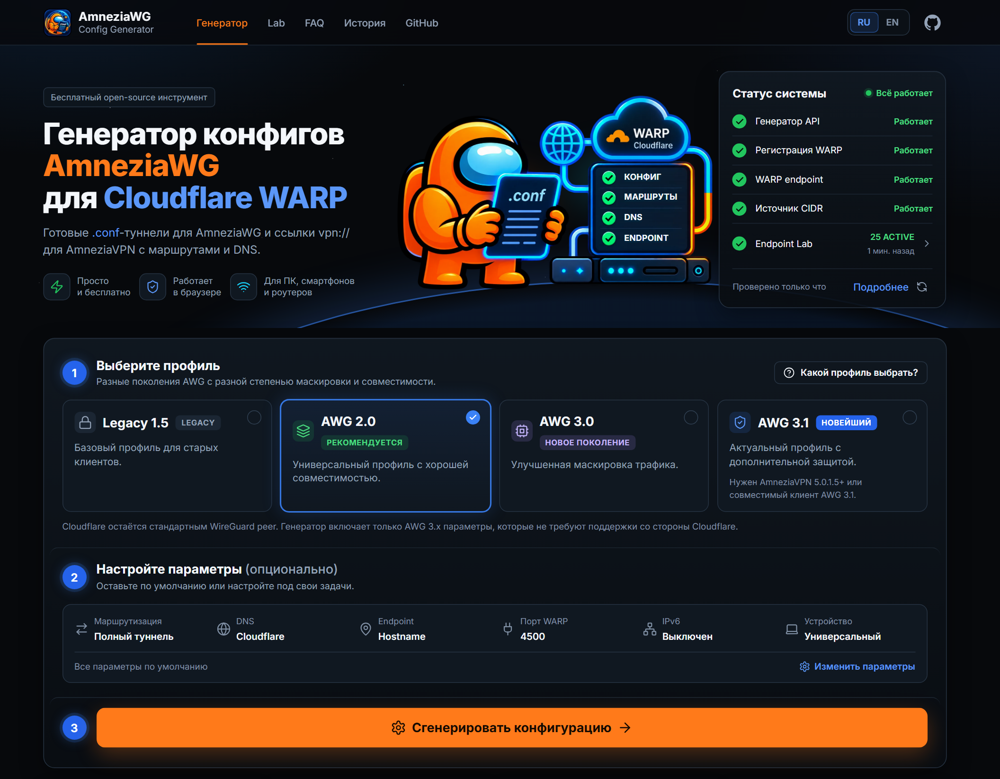

# 🌐🔧 Генератор конфигурации AmneziaWG

[English](./README.md) | [Русский](./README.ru.md)

Веб-интерфейс и HTTP API для сборки файлов `.conf` под клиент **AmneziaWG** (WireGuard с расширениями Amnezia). Основной сценарий — профиль **Cloudflare WARP**: регистрация через официальный API, выдача ключа и параметров туннеля, опционально сужение `AllowedIPs` по выбранным пресетам доменов. С версии 3.0 endpoint можно взять и из **Endpoint Lab** — собственной проверки WARP endpoint'ов проекта.

| | |
| --- | --- |
| **Генератор** | <https://awgconfig.com/> |
| **Telegram-канал** | <https://t.me/amnezia_config> |
| **Исходный код** | <https://github.com/HereIamGosu/amnezia-config-gen> |

[](LICENSE)
[](https://nodejs.org/)
[](https://github.com/HereIamGosu/amnezia-config-gen/actions/workflows/ci.yml)
[](https://github.com/HereIamGosu/amnezia-config-gen/releases/latest)
[](https://github.com/HereIamGosu/amnezia-config-gen/commits/main)
[](https://github.com/HereIamGosu/amnezia-config-gen/issues)



## Возможности

- Явный выбор режима маршрутизации: полный туннель (весь трафик) или выборочная маршрутизация (только выбранные направления)
- Четыре формата: **Legacy**, **AWG 2.0**, **AWG 3.0** и **AWG 3.1** (`mode=legacy|awg2|awg3|awg31`). Для AWG 3.x применяется WARP-safe клиентский профиль.
- До трёх конфигов за один запрос (`count=1..3`), у каждого своя регистрация WARP и свои ключи.
- **Endpoint Lab** (`/lab`, `/en/lab`, `GET /api/lab`): публичный просмотр WARP endpoint'ов (`IP:UDP-порт`), которые сервер проекта проверяет настоящим WireGuard handshake и HTTPS-трафиком через туннель. Прошедший проверку endpoint считается ACTIVE 7 минут, дальше он должен пройти её снова. Проверки идут с сервера проекта: они показывают, что endpoint работает оттуда, а не из любой сети.
- **Lab Auto** (`endpointMode=lab`): каждый конфиг получает свой свежий ACTIVE endpoint из Lab, IP не повторяются. Без свежих данных Lab конфиг не создаётся (`503 lab_*`), молчаливой подмены нет. В веб-интерфейсе это endpoint по умолчанию, пока пул Lab свежий; иначе интерфейс выбирает hostname `engage.cloudflareclient.com` и объясняет почему, а при отказе Lab предлагает явную кнопку «Сгенерировать через hostname». В API по умолчанию по-прежнему hostname.
- Тёмный интерфейс на русском (`/`) и английском (`/en`); язык определяется адресом. Карточка «Статус системы» показывает API генератора, регистрацию WARP, WARP endpoint, источник CIDR и Endpoint Lab.
- Пресеты маршрутов: тайл-выбор по категориям доменов → агрегированные IPv4 (или IPv4+IPv6) CIDR в `AllowedIPs`. Без выбора по умолчанию используется `0.0.0.0/0`; `::/0` добавляется только при явном включении IPv6.
- Несколько пресетов DNS для строки `DNS` в конфиге.
- Скачивание `.conf` для импорта в AmneziaWG и совместимые клиенты.
- После генерации карточка результата объясняет формат AWG, число вариантов, источники endpoint и маршрутов, профили, IPv6, наличие `vpn://`, уровни риска и первые шаги диагностики.
- Опциональные расширения `cps5`, `mobile`, `link` (см. [Опциональные расширения](#опциональные-расширения)).
- Запросы к Cloudflare WARP API с повторными попытками при сетевых ошибках и ответах 429 / 502 / 503 / 504.

## Telegram-канал

В Telegram-канале **[Amnezia Config](https://t.me/amnezia_config)** публикуются разборы обновлений генератора, диагностика проблем с endpoint, DNS, UDP, AllowedIPs, mobile profile и импортом конфигов.

Канал не обещает универсальную работу конфига в любой сети. Материалы объясняют, как устроены настройки и где искать причину, если подключение ведёт себя по-разному на разных устройствах или сетях.

## Требования

- **Node.js 22** (`engines` в `package.json`).
- **Vercel CLI** нужен только для `npm start` (`vercel dev`): `npm i -g vercel` или `npx vercel dev`.

Отдельного `.env` для работы API не требуется — обращение идёт к публичному `api.cloudflareclient.com`.

## Локальный запуск

```bash
npm install
npm start          # vercel dev → http://localhost:3000
# или тот же runtime, что в production, без Vercel:
node server.js     # http://localhost:3000 (PORT, HOST)
```

Если открыть только статические файлы из `public/` без сервера, интерфейс подгрузит список пресетов из `public/static/presets-fallback.json`, но вызовы `/api/iplist` и `/api/warp` работать не будут.

Данных Endpoint Lab в репозитории нет. Локально `/lab` сообщает, что данных Lab нет, `/api/lab` отвечает `503 lab_not_available`, Lab Auto — `503 lab_unavailable`; режим hostname работает. Чтобы увидеть Lab локально, укажите в `ENDPOINT_LAB_PUBLIC_DIR` (абсолютный путь, читается при старте) копию публичного каталога Lab.

## Деплой

Официальный сайт <https://awgconfig.com/> размещён на собственном сервере: каждый push в `main`,
прошедший CI, собирается один раз, проверяется и публикуется в GHCR по digest; сервер сам забирает
проверенный образ и переключает трафик blue/green с автоматическим откатом. Подробности:
[`deploy/CI_CD.md`](deploy/CI_CD.md), [`deploy/CONTROLLER.md`](deploy/CONTROLLER.md).

Endpoint Lab работает на том же сервере отдельной хостовой службой (`deploy/endpoint-lab/`);
веб-контейнер получает только публичный каталог Lab без секретов, смонтированный только для чтения.
Подробности: [`deploy/ENDPOINT_LAB.md`](deploy/ENDPOINT_LAB.md).

Форки по-прежнему работают на **Vercel**: подключите репозиторий в панели Vercel или выполните
`vercel` / `vercel --prod` из каталога проекта. У форка нет Endpoint Lab: генератор работает в
режиме hostname, `/lab` сообщает, что данных Lab нет.

## Privacy-safe telemetry

Продуктовые события отправляются через существующую Yandex.Metrika с помощью no-op-safe adapter `public/static/analytics.js`. Если аналитика недоступна или заблокирована, генерация и остальные действия продолжают работать без ошибок.

События: `generation_started`, `generation_succeeded`, `generation_partially_succeeded`, `generation_failed`, `config_downloaded`, `config_preview_opened`, `vpn_link_copied`, `history_item_previewed`, `history_item_downloaded`, `healthcheck_opened`, `status_modal_opened`.

Разрешены только ограниченные продуктовые метаданные: режим, количества конфигов, категории источников endpoint/маршрутов, предупреждения, full/split, mobile/router, CPS, безопасные boolean-флаги WARP-safe/timing/experimental padding, длительность и категория ошибки. Adapter **не собирает** содержимое `.conf`, ключи, WARP-токены, полные endpoint-строки, `AllowedIPs`, custom CIDR, исходные сообщения ошибок и полный user agent.

## Структура репозитория

| Путь | Назначение |
|---|---|
| `public/index.html` | Точка входа UI (русская версия, `/`) |
| `public/en/index.html`, `public/en/lab/index.html` | Английские страницы (`/en`, `/en/lab`), генерируются `npm run seo:en` — не править вручную |
| `public/lab/` | Страница Endpoint Lab (`/lab`): разметка, стили и скрипты |
| `public/404.html`, `robots.txt`, `sitemap.xml`, `llms.txt`, `.well-known/security.txt` | Страница ошибки и файлы для поисковиков, ИИ-поиска и сообщений об уязвимостях |
| `public/static/*.js`, `styles.css` | Фронтенд: `script.js` (генерация и связка) плюс `i18n.js`, `common.js`, `status.js`, `live-status.js`, `result.js`, `result-explanation.js`, `settings.js`, `settings-link.js`, `history.js`, `share-link.js`, `ui-shell.js`, `analytics.js`, `metrika.js`, `status-page.js`; стили |
| `public/locales/{ru,en}.json` | Строки интерфейса на двух языках |
| `public/static/presets-fallback.json` | Запасной каталог пресетов без API |
| `api/warp.js` | Эндпоинт генерации WARP-конфига (режим hostname и Lab Auto) |
| `api/iplist.js` | Список пресетов и предпросмотр CIDR |
| `api/status.js`, `api/healthcheck.js` | Данные для карточки «Статус системы» |
| `api/lab.js` | Данные Endpoint Lab для `/lab`, только чтение |
| `src/server/awg/` | AWG-профили, строгие ranges, WARP safety и финальная сериализация |
| `src/server/routePresets.js` | Каталог пресетов и DNS (источник правды) |
| `src/server/ipListFetch.js` | Получение CIDR по доменам (in-memory кэш 10 мин) |
| `src/server/warpCpsPayloads.js`, `src/server/cps/` | Пул верифицированных WARP-совместимых CPS payload'ов и генераторы CPS-пакетов |
| `src/server/cps-presets/` | Текстовые файлы для query-параметра `i1Ref` |
| `src/server/cpsExtraPackets.js` | Генерация I2..I5 для `cps5=1` |
| `src/server/vpnLinkBuilder.js` | Сборка `vpn://...` ссылки для AmneziaVPN |
| `src/server/labPublic.js`, `src/server/endpointProvider.js` | Чтение и проверка публичных файлов Lab; выбор endpoint'ов для Lab Auto |
| `src/server/_rateLimit.js` | Per-IP rate-limit (10 генераций/мин) |
| `server.js` | Self-hosted runtime для production: маршруты и заголовки из `vercel.json` |
| `deploy/` | Docker-образ, nginx, контроллер blue/green-деплоя, хостовая служба Endpoint Lab (`deploy/endpoint-lab/`) |
| `scripts/dump-presets-fallback.js` | Пересборка `presets-fallback.json` из `routePresets.js` |
| `__tests__/` | Набор тестов `node:test`, включая тесты критических инвариантов `invariant-*.test.js` |
| `e2e/` | Браузерные тесты в локальном Chrome (`npm run test:e2e`) |

## Критические инварианты

Эти правила нетривиальны, легко нарушить, и сломанный туннель проявляется молча. Они закреплены в `__tests__/invariant-*.test.js`. **При изменении любого инварианта обновляйте и тест, и этот блок.**

| ID | Правило | Почему |
|---|---|---|
| **I1** | Строка в `[Interface]` ОБЯЗАНА быть **uppercase** `I1`, не `i1`. | Lowercase `i1` молча игнорируется AmneziaWG-клиентом для Windows. Источник: [wg-easy/wg-easy#2439](https://github.com/wg-easy/wg-easy/issues/2439). |
| **I2** | Во всех WARP-safe профилях AWG 2/3.x: `S1 = S2 = S3 = S4 = 0`. | Cloudflare — стандартный WireGuard peer и не добавляет AWG-префиксы. |
| **I3** | Во всех WARP-safe профилях AWG 2/3.x: `H1..H4 = 1, 2, 3, 4`. | Cloudflare ожидает стандартные WireGuard message types. |
| **I4** | WARP-safe профили используют `MTU = 1280`; AWG 3.x не выводит `HeaderProtectionKey` и не включает `RandomTrailers`; AWG 3.1 может включать локальный `DisableCookies`. | Peer-dependent wire-format несовместим со стандартным Cloudflare peer; локальное cookie-поведение не требует поддержки Cloudflare. |
| **I5** | Порядок полей в `[Interface]` для AmneziaWG 2.0: `PrivateKey → Address → DNS → MTU → Jc → Jmin → Jmax → S1..S4 → H1..H4 → I1`. | Совпадает с порядком, который принимает UAPI `amneziawg-go`. |
| **I6** | `AllowedIPs` по умолчанию **только IPv4**; IPv6 включается по тумблеру в Настройках (`?ipv6=1`). | Роутеры (GL.iNet, Keenetic, MikroTik) и мобильные клиенты имеют ограниченную ёмкость таблицы маршрутов; удвоение списка через IPv6 приводит к молчаливым отказам. |
| **I7** | `mobile=1` форсит: `Jc=3, Jmin=64, Jmax=128, MTU=1280`, только IPv4 (перекрывает `ipv6=1`, убирает IPv6 из `Address` и `AllowedIPs`). | Мобильный профиль в пределах спецификации AWG 2.0; снижает расход батареи и молчаливые reset'ы на iOS. |
| **I8** | Если одновременно `mobile=1` и `router=1`, сначала применяется `mobile`, потом `router` через `Math.min`/`Math.max`. На пересечении побеждает `router` (например, итог `Jc = 2`). | Правило композиции реализовано в `applyRouterModeCaps` после `applyMobileModeOverrides`. |
| **I9** | `cps5=1` добавляет `I2`–`I5` для AWG 2.0/3.x при непустом `I1`. | Legacy и режимы AWG без `I1` не должны выдавать неполную CPS-цепочку. |
| **I10** | `vpn://` проходит Qt `qCompress` round-trip и помечает payload как готовый сторонний AWG-профиль. | AmneziaVPN не должна переводить импорт готового конфига в сценарий установки протокола. |
| **I11** | Lab Auto (`endpointMode=lab`) меняет только `Endpoint`: для того же запроса остальные поля, их порядок и метаданные ответа совпадают с hostname-режимом (ключи, размеры junk и CPS-пакеты случайны в обоих). Без пригодных данных Lab — `503 lab_*` до регистрации WARP и никогда не hostname. | Endpoint Lab выбирается на запрос из пула, проверенного минуты назад; молчаливая подмена на hostname скрыла бы, что запрошенной проверки не было. |

## API

### `GET` / `POST` `/api/warp`

Возвращает JSON: `success`, при успехе `content` (тело `.conf` в **base64**; при `count` > 1 — первый конфиг), `configs` (каждый конфиг со своими `content`, `endpointSource`, CPS-полями и `vpnLink`), `count`, `mode` (`legacy` | `awg2` | `awg3` | `awg31`), опционально route metadata, `appliedExtras`, `vpnLink`, `compatibility` и AWG 3.x-only capability metadata `awg`.

Параметры через query (`GET`) или поля JSON-тела (`POST`). Имена в теле совпадают с query (удобно для длинного `i1`).

| Параметр | Описание |
|---|---|
| `mode` | `legacy` (по умолчанию), `awg2`, `awg3` или `awg31`; AWG 3.x aliases: `3`, `3.0`, `awg30`, `v3`, `3.1`, `v3.1` |
| `count` | `1`–`3` конфига в одном ответе (по умолчанию `1`); каждый — отдельная регистрация WARP |
| `presets` | Ключи пресетов через запятую (или массив в JSON-теле) |
| `dns` | Ключ пресета DNS; в UI по умолчанию `cloudflare` |
| `template` | См. [Шаблоны](#шаблоны) |
| `peerEndpoint`, `endpoint` | Полная строка `host:port` для `Endpoint` (если задана — используется как есть) |
| `warpPort` | UDP-порт для `engage…` или IP-fallback (для WARP-шаблонов по умолчанию **4500**; для классического wgcf часто **2408**) |
| `endpointMode` | `hostname` (по умолчанию, поведение не меняется) или `lab` — Lab Auto: каждый конфиг получает отдельный свежий ACTIVE endpoint Endpoint Lab. Запрошенный порт — предпочтение: Lab проверяет 2408/500/1701/4500, нехватка на этом порту добирается другими проверенными портами с предупреждением. Разных endpoint'ов меньше, чем `count` → меньше конфигов и предупреждение, без повторов. Только для WARP-шаблонов; несовместим с `peerEndpoint`. |
| `persistentKeepalive`, `keepalive` | Для старых режимов integer; для AWG 3.x строгий integer или `min-max` (default `25-35`) |
| `rekeyAfterTime`, `rekeyTimeout`, `rejectAfterTime`, `keepaliveTimeout`, `maxHandshakeAttempts` | Строгие AWG 3.x integer/range overrides; defaults: `100-120`, `3-7`, `150-180`, `5-15`, `15-20` |
| `contentPaddingAddition` | Padding внутри шифрованного AWG 3.x payload; default `10-100`; `off`, `0` или `0-0` отключает; допустим строгий integer/range `0..65535` |
| `experimentalContentPadding` | Deprecated-флаг совместимости; `true` по-прежнему принимается, но padding теперь управляется напрямую через `contentPaddingAddition` |
| `disableCookies` | Строгий AWG 3.1-only toggle `on/off` (также `true/false/1/0`); default `on` |
| `i1` | Сырая строка CPS / obfuscation (AWG 2.0) |
| `i1Ref` | Имя файла из `src/server/cps-presets/` |
| `cps` | `auto` (только стабильные `static` / `sip` / `stun`) либо явный `static`, `sip`, `stun`, `quic`, `dns`, `dtls`; последние три экспериментальны. `tls` и неизвестные идентификаторы возвращают HTTP 400. |
| `plainAddress` | `1` / `true` — в `Address` без `/32` и `/128` |
| `ipv6` | `1` — также включить IPv6 CIDR из пресетов |
| `cps5` | `1` — добавить случайные `I2`..`I5` в `[Interface]` (для `mode=awg2`, `awg3`, `awg31`; требует непустой `I1`) |
| `mobile` | `1` — мобильный профиль (см. I7) |
| `router` | `1` — профиль с router-капами |
| `link` | `1` — добавить в JSON-ответ поле `vpnLink: "vpn://..."` для импорта в AmneziaVPN одним тапом |

Ошибки: JSON `{ success: false, message }`; коды 4xx/5xx по ситуации.

Lab Auto добавляет `endpointSource: "lab"` в каждый конфиг и `lab: { requested, selected, requestedPort, portMatched, ports }`. Отказы — `{ success: false, error, message }`: `400 invalid_endpoint_mode`, `400 endpoint_mode_conflict` (вместе с `peerEndpoint`), `400 lab_template_unsupported` (не WARP-шаблон); `503 lab_unavailable` (данных Lab нет, они непригодны или Lab сам сообщает о недоступности), `503 lab_stale`, `503 lab_no_endpoints` с `Retry-After: 60`. Свежесть решается один раз, до регистрации; дальше запрос использует выбранные endpoint'ы.

### `GET` `/api/iplist`

Без `?presets=...`: возвращает каталог пресетов целиком (`presets`, категории, `dnsPresets`, `dnsDefault` и т.д.).

С `?presets=key1,key2`: разрешение доменов в CIDR. Ответ: `{ count, count4, count6, cidrs, sites, sitesQueried, cidrSource }`. `cidrSource` сообщает фактический источник маршрутов (`opencck`, `community`, `mixed`, `antifilter` или `static`). Неизвестные ключи → 400 со списком отсутствующих.

### `GET` `/api/lab`

Данные Endpoint Lab для `/lab`, только чтение: эндпоинт ничем в Lab не управляет. Без параметров — обзор (`status`, `generatedAt`, `freshness`, события и `endpoints` с публичными состояниями `ACTIVE`, `VERIFIED`, `SUSPECT`). С `?endpoint=<ip:port>&range=24h|7d|30d|all` (по умолчанию `all`) — история одного endpoint'а.

Ошибки — `{ success: false, code }`: `400 endpoint_invalid`, `400 range_invalid`, `404 endpoint_not_found`, `405 method_not_allowed`; `503 lab_not_available`, если публичных файлов Lab нет (Vercel, форки, Lab не смонтирован), и `503 lab_malformed`, если они не прошли проверку, оба с `Retry-After`. Ответы идут с `Cache-Control: no-store` и `X-Robots-Tag: noindex, nofollow`.

### `GET` `/api/status`

Сводка реестра endpoint'ов для карточки «Статус системы»: `status`, `updated_at`, `active_endpoints`, по портам `ports` и `candidates` (только количества, без IP), `health_source`, `message` и `lab: { available }` — есть ли данные Endpoint Lab.

### `GET` `/api/healthcheck`

TCP-доступность `api.cloudflareclient.com:443`, `engage.cloudflareclient.com:443` и `iplist.opencck.org:443`: `{ services: { api, engage, cidr }, checkedAt }`. Результат кэшируется на 30 секунд.

## Шаблоны

| Значение | Поведение |
|---|---|
| *(нет)* + `mode=legacy` | Как `warp_amnezia` |
| *(нет)* + `mode=awg2` | Как `warp_amnezia_awg2` |
| *(нет)* + `mode=awg3` / `mode=awg31` | WARP-safe профиль AWG 3.0 / 3.1 |
| `warp_amnezia`, `amnezia`, `amnezia_warp` | Legacy WARP с engage-хостом, встроенный `I1` при отсутствии пользовательского, `plainAddress`, keepalive 25 |
| `warp_amnezia_awg2`, `amnezia_awg2`, `awg2_amnezia`, `warp_awg2_amnezia` | AWG 2.0 WARP — те же peer/DNS/Address/I1 что и Legacy WARP, с WARP-safe S=0 / H=1..4 / MTU=1280 |
| `warp_amnezia_awg3`, `warp_awg3_amnezia` | AWG 3.0 WARP-safe профиль |
| `warp_amnezia_awg31`, `warp_awg31_amnezia` | AWG 3.1 WARP-safe профиль с явными безопасными 3.1-флагами |
| `wgcf` | `engage.cloudflareclient.com`, UDP 4500, без встроенного I1 |
| `awg2_random`, `awg2_dpi` | Случайные H-полосы — **НЕ** для Cloudflare WARP; свой endpoint задаёте сами |

## Опциональные расширения

### Статус CPS-протоколов

| Протокол | Статус | Auto | Примечание |
|---|---|---:|---|
| Static | stable | да | Проверенный проектный пул WARP payload |
| SIP | stable | да | Согласованный рандомизированный SIP INVITE |
| STUN | stable | да | Binding Request с корректным FINGERPRINT |
| QUIC | experimental | нет | Защищённый пакет в форме QUIC v1 Initial; interop не подтверждён |
| DNS | experimental | нет | Пакет в форме DNS response; interop не подтверждён |
| DTLS | experimental | нет | Пакет в форме DTLS 1.2 ClientHello; interop не подтверждён |
| TLS | unsupported | нет | Отклоняется с HTTP 400 |

| Параметр | Эффект |
|---|---|
| `cps5=1` | Когда `mode` — `awg2`, `awg3` или `awg31` и `I1` непустой, сервер добавляет `I2..I5` (случайный hex 16–64 байт через `crypto.randomBytes`) в `[Interface]`. Для Legacy и пустого `I1` молча игнорируется. |
| `mobile=1` | Мобильный профиль по инварианту **I7**. |
| `router=1` | Router-капы (`Jc≤2`, `Jmin∈[40,128]`, `Jmax∈[Jmin+1,128]`); компонуется с `mobile` по инварианту **I8**. |
| `link=1` | В ответе появляется `vpnLink: vpn://<base64url(qCompress(JSON))>` для импорта в AmneziaVPN одним тапом. |

`appliedExtras: { cps5, mobile }` в ответе сообщает что фактически применилось (`cps5` может быть `false` даже когда запрошено — Legacy-режим его молча игнорирует).

Успешный ответ также содержит безопасные метаданные `cpsRequested`, `cpsResolved`, `cpsStability` и дополнительное поле `cpsEvidenceStatus`. При `count=1..3` каждый элемент `configs[]` сообщает собственный результат; Auto разрешается независимо для каждого конфига. QUIC формирует защищённый 1200-байтный пакет в форме QUIC v1 Initial и делит его на соседние fixed-byte CPS-теги без усечения, но остаётся экспериментальным до подтверждения совместимости с WARP. Static/SIP/STUN имеют статус stable и проектное evidence verified; QUIC/DNS/DTLS экспериментальны, TLS не поддерживается, Auto выбирает только stable.

## Совместимость

Начиная с 2.7.0 ответ `/api/warp` содержит опциональное additive-поле `compatibility`
(`recommended` / `experimental` / `notRecommended` / `warnings`). Это только метадата: она не
содержит ключей, текста `.conf` или `vpn://` payload и не меняет существующие поля ответа. После
генерации UI показывает карточку совместимости — куда можно попробовать импортировать профиль.

Модель совместимости — [`src/server/clientCompatibility.js`](src/server/clientCompatibility.js),
функция `getCompatibilityForGeneration({ mode, exportType, mobile, router, link })`.

### AWG 2.0 и Cloudflare WARP

AWG 2.0 означает **параметры клиентской конфигурации**. Cloudflare WARP peer остаётся стандартным
WireGuard peer, поэтому часть параметров для WARP фиксирована намеренно. Выбор AWG 2.0 **не**
означает, что сервер Cloudflare поддерживает AWG 2.0.

### AWG 3.0 / 3.1 и Cloudflare WARP

Cloudflare остаётся стандартным WireGuard peer. Генератор включает клиентские AWG 3.x механизмы: junk/CPS packets, рандомизированные интервалы rekey/handshake/keepalive, диапазон `PersistentKeepalive` и шифрованный `ContentPaddingAddition` (`10-100` по умолчанию; `off`, `0` или `0-0` отключают его). AWG 3.1 также использует `DisableCookies=on`: параметр подавляет локальную ветку Cookie Reply при нагрузке, сохраняет обработку входящих cookie и ослабляет локальную защиту от DoS ради устойчивости к fingerprinting. `H1..H4` остаются `1..4`, `S1..S4` — нулевыми; Header Protection недоступен, а `RandomTrailers=on` отклоняется: допуск трейлеров Cloudflare не документирован, а механизм зависит от поведения принимающего peer. См. [актуальные протокольные доказательства](docs/protocol-evidence.md); исторические release notes описывают состояние своих выпусков.

Нужен современный AWG 3.x-compatible parser. Для AWG 3.1 рекомендуется AmneziaVPN 5.0.1.5+ или совместимый AWG 3.1 client. Совместимость роутеров зависит от их реализации. `vpn://` для AWG 3.0 намеренно недоступен, потому что исторический `protocol_version` не подтверждён; AWG 3.1 использует подтверждённый envelope `3.1`.

### Export targets

[`src/server/exportTargets.js`](src/server/exportTargets.js) — реестр v0 форматов вывода и их
статусов:

| Target | Статус |
|---|---|
| `.conf` | stable |
| `vpn://` | stable для прежних режимов и AWG 3.1; AWG 3.0 отключён до появления подтверждения protocol mapping |
| QR | experimental |
| sing-box / Mihomo / Clash | experimental |
| Throne | research |
| OpenWrt | documentation |

Experimental и research форматы **не** являются стабильными экспортерами — они помечены честно,
чтобы их не приняли за рабочий путь импорта. Генератор снижает количество ручной настройки, но не
гарантирует работу в любой сети и любом клиенте.

## NPM-скрипты

| Команда | Действие |
|---|---|
| `npm start` | `vercel dev` |
| `npm run lint` | ESLint (`--max-warnings 0`) |
| `npm test` | Все тесты через встроенный `node:test` |
| `npm run test:e2e` | Браузерные тесты в локальном Chrome (`e2e/`) |
| `npm run test:coverage` | Тесты с экспериментальным coverage |
| `npm run presets:fallback` | Пересобрать `public/static/presets-fallback.json` из `src/server/routePresets.js` |
| `npm run evidence:check` | Проверить, что протокольные доказательства (`docs/protocol-evidence.md`) актуальны; `evidence:generate` пересобирает их |
| `npm run release:check` | Согласованность релиза: `package.json`, CHANGELOG, ключи `?v=` у ассетов, упоминания версии в README |
| `npm run indexnow` | Отправить адреса из sitemap в IndexNow (Bing, Яндекс и другие); `--wait-revision <sha>` ждёт выкладки, `--since <commit>` пропускает релизы без изменений, `--dry-run` |
| `npm run seo:en` | Пересобрать английские страницы `public/en/index.html` и `public/en/lab/index.html` из русских и `public/locales/en.json` (`seo:check` проверяет) |
| `npm run assets:build -- <dir>` | Минифицировать и предварительно сжать статические файлы в `<dir>`; Docker-сборка запускает его на копии `public/` |
| `npm run build` | Заглушка (сборка не нужна) |

Запустить один файл тестов: `node --test __tests__/invariant-i1-uppercase.test.js`.

Fallback smoke-покрытие релиза 2.4.1 находится в `__tests__/fallback-smoke.test.js`: генерация без KV, частичная недоступность endpoint-кандидатов, fallback CIDR-источника, источник реестра в `/api/status` и источник маршрутов в `/api/iplist`.

Ручная проверка импорта `vpn://` на iOS: [docs/manual-checks/vpn-link-ios.md](docs/manual-checks/vpn-link-ios.md).

## Участие

См. [CONTRIBUTING.md](./CONTRIBUTING.md). Для security-репортов: [SECURITY.md](./SECURITY.md). Все участники подчиняются [Code of Conduct](./CODE_OF_CONDUCT.md).

## Лицензия

[AGPL-3.0-only](./LICENSE) — © 2026 HereIamGosu.

## Star History

<a href="https://star-history.com/#HereIamGosu/amnezia-config-gen&Date">
 <picture>
   <source media="(prefers-color-scheme: dark)" srcset="https://api.star-history.com/svg?repos=HereIamGosu/amnezia-config-gen&type=Date&theme=dark" />
   <source media="(prefers-color-scheme: light)" srcset="https://api.star-history.com/svg?repos=HereIamGosu/amnezia-config-gen&type=Date" />
   
 </picture>
</a>

## Контакты

- Discord: <https://discord.gg/XGNtYyGbmM>
- Сайт сервера: <https://valokda.vercel.app/>
